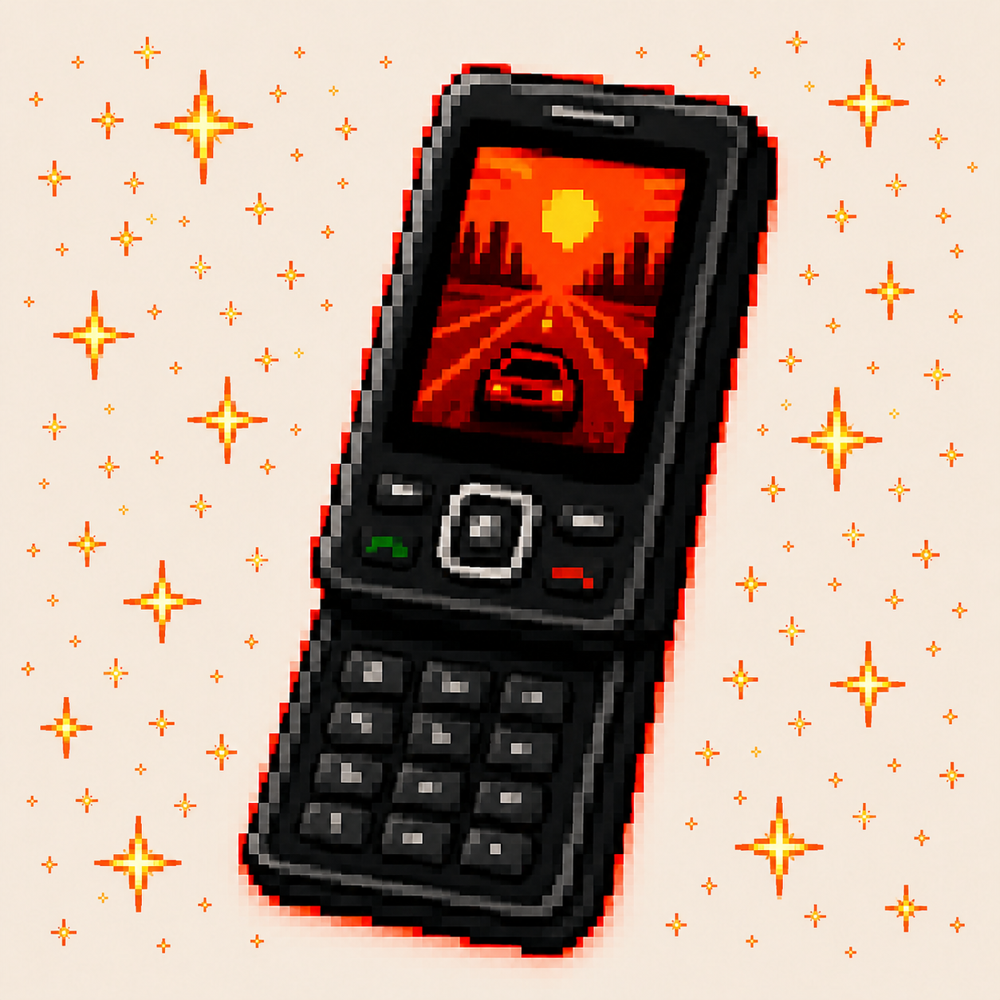
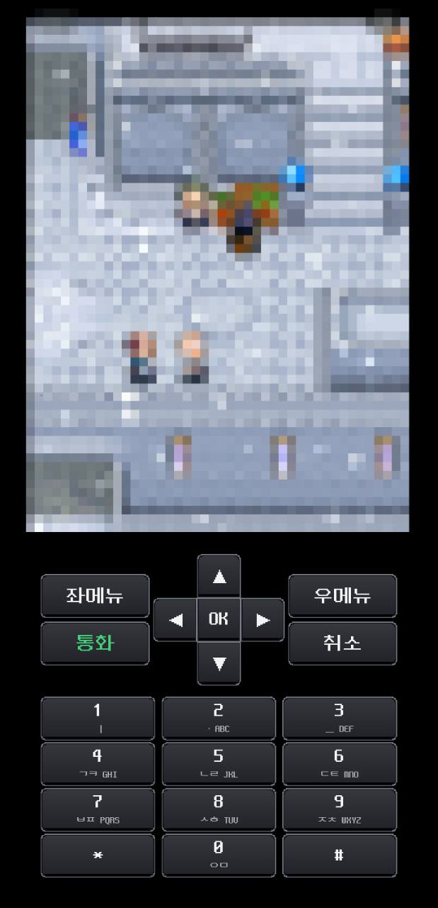
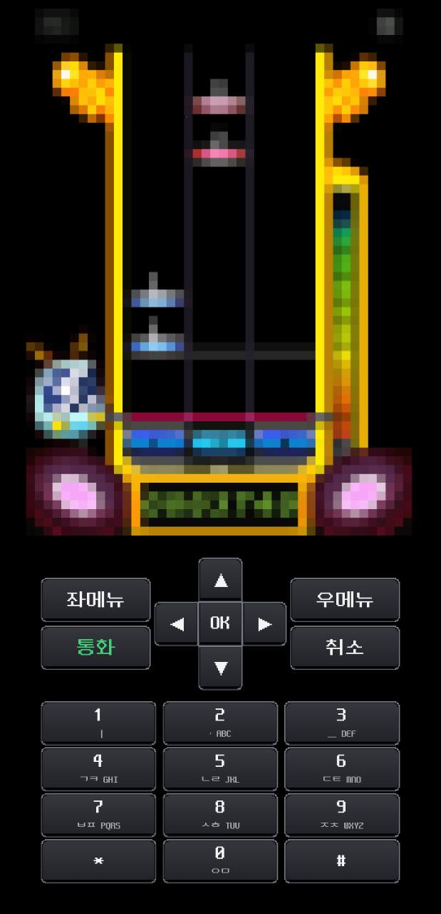
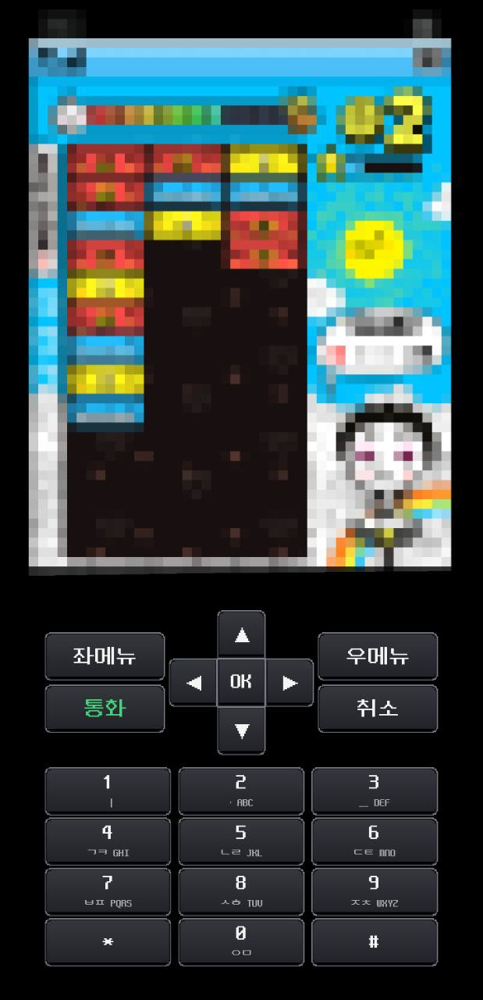
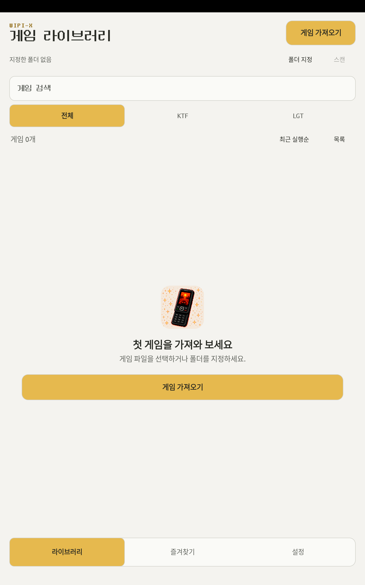
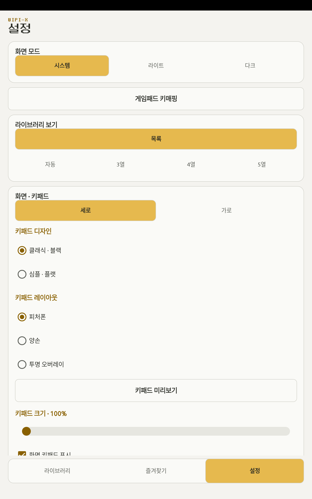
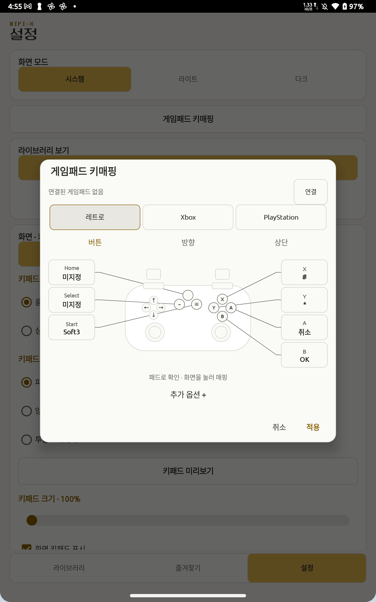
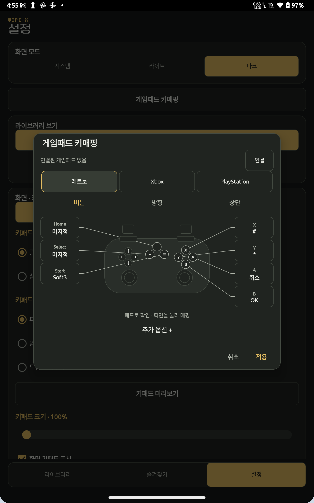

  

# WIPI-X

**그 시절 피쳐폰 게임을, 오늘의 Android에서.**

WIPI-X는 KTF·LGT WIPI 게임 파일을 Android에서 실행하는 오프라인 피쳐폰 게임 에뮬레이터입니다. Valio Studio가 만들고 있습니다. Android 8.0 이상에서 사용하며, 게임 파일과 저장 데이터는 기기 안에서 처리합니다.

[공식 홈페이지](https://wipix.valiostudio.com/) · [테스트 참여 안내](docs/TESTING.md) · [릴리즈 노트](https://github.com/hun99999/wipi-x-releases/releases) · [게임 카탈로그](https://wipix.valiostudio.com/ko/games/) · [문제 제보](https://github.com/hun99999/wipi-x-releases/issues/new/choose)

> **최신 기록 · 0.1.7 Alpha / Play 심사 요청** — [WIPI-X 0.1.7 — 레트로 스킨·키패드·저장 날짜 개선](https://github.com/hun99999/wipi-x-releases/releases/tag/v0.1.7) · [전체 릴리즈 보기](https://github.com/hun99999/wipi-x-releases/releases)

## 플레이 화면

익숙한 피쳐폰 키패드로 Android에서 플레이하는 모습입니다. 게임 영역은 모자이크 처리했습니다. 앱에는 게임 파일이 포함되어 있지 않습니다.

  
  
  

## 앱 받기

**WIPI-X 앱의 공식 설치와 업데이트는 Google Play에서만 제공합니다.** **0.1.7 (Alpha)**를 2026년 9월 12일 심사 요청했습니다. Play 제공은 대기 중이며, 현재 제공이 확인된 버전은 **0.1.6**입니다. 새 버전이 반영되면 기존 앱에서 업데이트할 수 있습니다.

[WIPI-X 테스트 그룹](https://groups.google.com/g/wipi-x-testers/about)에 가입한 뒤, **같은 Google 계정**으로 [Google Play 테스트 참여](https://play.google.com/apps/testing/com.valiostudio.wipix)를 신청하고 설치하세요. [참여 순서와 대상 기기](docs/TESTING.md), [버전별 릴리즈 노트](https://github.com/hun99999/wipi-x-releases/releases)를 확인할 수 있습니다.

이 GitHub는 프로젝트 소개, 사용 안내, 호환 현황과 사용자 지원을 위한 공간입니다. 앱 소스코드, APK/AAB 설치 파일 및 게임 파일은 게시하지 않습니다.

## WIPI-X로 할 수 있는 일

- **게임 가져오기:** 여러 파일을 한 번에 선택하거나 폴더를 지정해 하위 폴더까지 찾습니다. 새 파일은 스캔 버튼으로 추가합니다.
- **피쳐폰 키패드:** 클래식·플랫 디자인과 가로·세로 배치를 선택하고, 가상 화면에서 오버레이 위치와 크기를 직접 조정합니다. 게임 속 문자 입력은 천지인 한글과 영문 반복 누르기로 제공합니다.
- **0.1.7 레트로 스킨:** WIPI-X 16-bit 실버와 지원되는 Delta 스킨 가져오기, 기존 공통·게임별 매핑 공유를 추가했습니다. 피처폰 십자키 접기도 제공합니다. Play 반영 뒤 사용할 수 있습니다.
- **게임패드:** 레트로·Xbox·PlayStation 배열과 공통·게임별 키매핑을 지원합니다. 매핑 화면에서 버튼을 누르면 해당 위치가 켜집니다.
- **화면과 속도:** 화면 비율을 유지한 확대, 0.5–4배속, 상태바·키패드 표시와 진동을 설정합니다. 라이트·다크·시스템 테마를 선택할 수 있습니다.
- **라이브러리:** 검색·통신사 필터·즉시 정렬·그리드/목록으로 게임을 찾습니다. 게임을 길게 눌러 즐겨찾기와 저장을 관리합니다.
- **더보기와 업데이트:** 설정·사용 안내·GitHub·문제 제보로 이동하고 새 버전을 확인합니다. 앱 시작 시 업데이트를 안내하며 건너뛴 버전은 자동으로 다시 안내하지 않습니다.
- **저장 백업:** 게임 안에서 저장하고 정상 종료한 뒤, 게임별 저장을 내보내거나 같은 게임에 다시 가져옵니다.

게임은 오프라인으로 실행하며 로그인·광고·인앱 결제 없이 동작합니다. 앱 시작과 수동 업데이트 확인에는 GitHub 공개 릴리스 조회를 위한 인터넷 연결을 사용합니다. 기기와 게임에 따라 실행·저장 범위와 배속 성능은 다를 수 있습니다. [0.1.7 변경 안내](docs/UPDATES.md)에서 이번 테스트 버전의 내용을 확인할 수 있습니다.

## 라이브러리와 설정

0.1.0 테스트 앱을 실제 Android 태블릿에서 촬영한 화면입니다. 게임을 가져오기 전의 라이브러리와 설정·키매핑 화면을 사용해 게임 이름, 게임 아이콘, 플레이 내용을 노출하지 않았습니다.

<table>
  <tr>
    <th>라이브러리 · 게임 가져오기</th>
    <th>화면과 키패드 설정</th>
  </tr>
  <tr>
    <td align="center"></td>
    <td align="center"></td>
  </tr>
  <tr>
    <th>게임패드 키매핑 · 라이트</th>
    <th>게임패드 키매핑 · 다크</th>
  </tr>
  <tr>
    <td align="center"></td>
    <td align="center"></td>
  </tr>
</table>

## 처음 시작하기

1. [테스트 참여 안내](docs/TESTING.md)에 따라 그룹 가입과 Play 테스트 참여를 마친 뒤 Google Play에서 앱을 설치합니다.
2. 이용 권한이 있는 게임 파일을 Android의 게임 전용 폴더에 준비합니다. **게임 한 개짜리 ZIP은 압축을 풀지 않고 그대로 사용합니다.**
3. WIPI-X의 **가져오기**에서 파일을 선택하거나 **폴더 지정 → 스캔**으로 추가하고 게임을 선택합니다.

[자세한 시작 안내](docs/GETTING_STARTED.md) · [호환성 및 1차 테스트 대상](docs/COMPATIBILITY.md) · [문의 안내](SUPPORT.md)

## 호환성

1차 테스트 대상은 **31개(KTF 18개 · LGT 13개)**입니다. 기존 28개에 **리듬스타(KTF), 2010프로야구(LGT), 템페스트(LGT)**를 포함했습니다. 현재 모두 최종 호환 확인 전이며, 대상 선정이 모든 기기에서의 정상 동작이나 전체 게임 진행을 보증하지는 않습니다. 호환 결과는 통신사, 정확한 게임 파일, WIPI-X 버전을 기준으로 안내합니다.

1차를 시작으로 확인한 게임을 계속 늘립니다. 홈페이지의 전체 게임 카탈로그는 게임을 찾아보기 위한 자료이며, 카탈로그 전체가 지원 확정 목록은 아닙니다. [1차 31개 전체 목록](docs/COMPATIBILITY.md)에서 통신사별 대상을 확인하세요.

## 제보와 제안

실행 문제, 사용 중 불편한 점, 개선 아이디어는 [GitHub Issues](https://github.com/hun99999/wipi-x-releases/issues/new/choose)에 남겨 주세요. 기기 모델, Android 버전, 앱 버전, 게임·통신사와 재현 방법이 있으면 확인에 도움이 됩니다.

이슈는 공개됩니다. 개인정보, 게임 원본, 저장 파일이나 비공개 다운로드 링크는 첨부하지 마세요. 스크린샷을 첨부할 때는 게임 이름·아이콘·플레이 영역을 모자이크나 충분한 블러로 가려 주세요.

[문의 안내](SUPPORT.md) · [개인정보처리방침](https://wipix.valiostudio.com/privacy/) · [지원 이메일](mailto:wipix@valiostudio.com)

## English

WIPI-X is an offline Android emulator for classic KTF and LGT WIPI feature-phone games, made by Valio Studio. It requires Android 8.0 or later and processes game files and saves on the device, without login, ads, or in-app purchases.

The app is distributed **exclusively through Google Play**. **0.1.7 (Alpha)** was submitted for review on September 12, 2026. Play availability is pending; **0.1.6** remains the version confirmed available. Join the testers group, opt in using the same Google account, and install through Google Play. See the [testing guide](docs/TESTING.md#english) and [release notes](https://github.com/hun99999/wipi-x-releases/releases).

Version 0.1.7 adds retro on-screen skins, supported Delta skin imports, shared controller mappings, a foldable phone D-pad, and corrected Zenonia save dates. These features will be available after Play rollout.

A fresh app launch or a manual check fetches public GitHub release information. Updates open in Google Play; skipped versions are not announced again automatically. Games remain offline.

Features include compact adaptive screens with pixel-style library/navigation, immediate sorting and grid/list switching, nested settings under More, direct touch overlay editing, folder scanning, classic and flat keypads, portrait and landscape layouts, Korean Cheonjiin and multi-tap English input, configurable gamepad mappings, light and dark themes, playback speed settings, and per-game save export/import. The first three images are user-provided gameplay screenshots with the game areas mosaicked. The library, settings and gamepad screenshots were captured from the 0.1.0 test app on an Android tablet.

This repository contains project information, usage guides, compatibility notes, and user support. It does not distribute app source code, APK/AAB packages, or game files. The initial roster contains **31 entries (18 KTF and 13 LGT)**, including Rhythm Star, 2010 Pro Baseball, and Tempest. All await final compatibility verification, and the roster will expand as more games are checked.

Questions and reports in Korean or English are welcome in [Issues](https://github.com/hun99999/wipi-x-releases/issues/new/choose).
